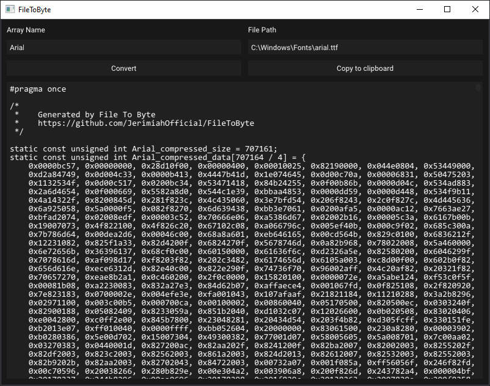

  <h1>FileToByte</h1>

  

FileToByte is a utility that transforms any file into a C-style array, facilitating its direct incorporation into C++ code for easy in-memory handling.

You can download latest binaries from [Releases](https://github.com/gage-lodba/FileToByte/releases/latest).

  

## Dependencies

 is an open-source, cross-platform family of tools designed to build, test and package software.

 is a low-overhead, cross-platform API, open standard for 3D graphics and computing.  
