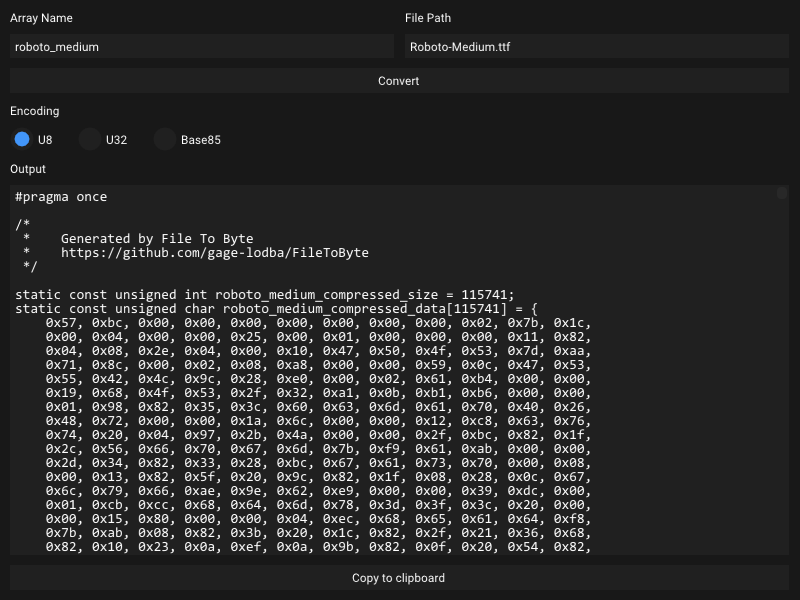

<div align="center">

  <h1>FileToByte</h1>

  <a href="https://github.com/gage-lodba/FileToByte/actions/workflows/BuildAndRelease.yml">
    
  </a>

</div>

FileToByte is a utility that transforms any file into a compressed C-style
array, ready to drop straight into C++ source for easy in-memory handling —
handy for embedding fonts, icons, shaders, or any asset directly into a binary.

You can download the latest binaries from [Releases](https://github.com/gage-lodba/FileToByte/releases/latest).

<div align="center">
  
</div>

## Usage

1. Enter an **Array Name** (the C symbol prefix) and the **File Path** to convert.
2. Pick an output **Encoding**.
3. Click **Convert**, then **Copy to clipboard** to grab the generated source.

The file is compressed with `stb_compress` before encoding, so the output stays
compact. The generated arrays match Dear ImGui's
`AddFontFromMemoryCompressed*TTF` loaders.

| Encoding | Output symbol | Notes |
| --- | --- | --- |
| **U8** (default) | `unsigned char <name>_compressed_data[]` | Hex bytes (`0x..`); endianness-independent |
| **U32** | `unsigned int <name>_compressed_data[]` | `0x........` words; endianness-dependent |
| **Base85** | `const char <name>_compressed_data_base85[]` | Smallest source; load via the Base85 loader |

## Building from source

FileToByte pulls in the [VulkanWindow](https://github.com/gage-lodba/VulkanWindow)
scaffold as a git submodule (which itself vendors GLFW, Dear ImGui, and
VulkanMemoryAllocator), so clone recursively:

```bash
git clone --recursive https://github.com/gage-lodba/FileToByte.git
cd FileToByte
cmake -B build -DCMAKE_BUILD_TYPE=Release
cmake --build build --config Release
```

Already cloned without `--recursive`? Fetch the submodules first:

```bash
git submodule update --init --recursive
```

The binary is written to `build/FileToByte` (Linux) or
`build/Release/FileToByte.exe` (Windows).

### Dependencies

- [CMake](https://cmake.org/) ≥ 3.12
- A C++23 compiler (GCC, Clang, or MSVC)
- The [Vulkan SDK](https://www.vulkan.org/) — or system Vulkan headers + loader

GLFW, Dear ImGui, and VulkanMemoryAllocator come in transitively through the
VulkanWindow submodule, so there's nothing else to install.
